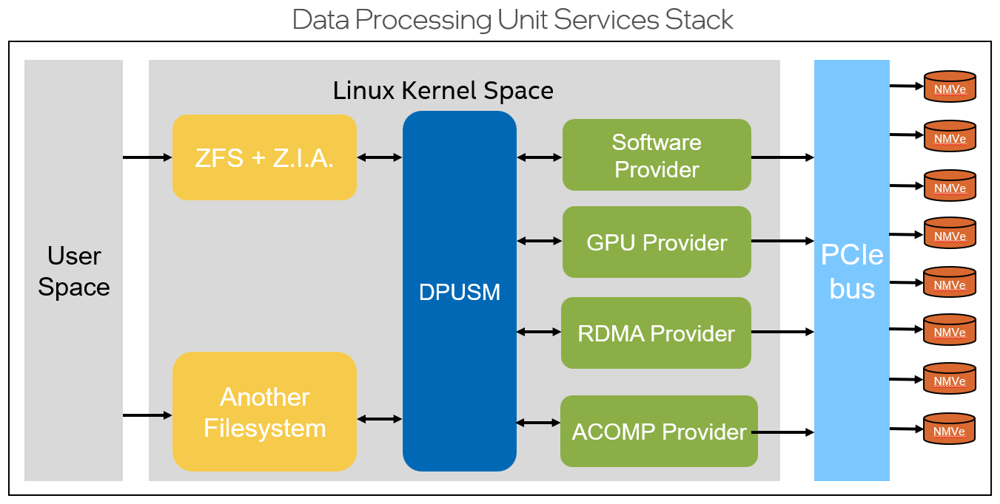

# Acompress Provider for DPUSM

## Table of Contents

- [Introduction](#introduction)
- [Licensing](#licensing)
- [Software Requirements](#software-requirements)
- [Limitations](#limitations)
- [Installation](#installation)
- [Legal](#legal)

## Introduction

The Acompress Provider is a plugin designed to integrate with DPUSM (Data Processing Unit Storage Management) and ZFS, utilizing the Z.I.A (ZFS Interface for Accelerators) framework. It enhances data compression capabilities within ZFS environments by leveraging the Crypto API's acomp interface for efficient data processing and storage management.

## Licensing

This project is licensed under the GNU General Public License v2.0. Please see the `LICENSE` file contained in the top-level folder for details.

## Software Requirements

- Linux Kernel with support for the Crypto API's acomp interface and zlib-deflate (currently covering versions 6.3 to 6.6).
- ZFS installed and operational configured with support for Z.I.A.
- DPUSM installed and configured.
- zpool configured to use this provider and compression offloading enabled

## Limitations

1. The Acompress Provider currently supports specific compression algorithms available through the Crypto API's acomp interface.
2. Ensure compatibility with your existing DPUSM and ZFS setup before integration.
3. Performance may vary based on hardware and system configuration.

## Installation

For detailed installation instructions, please refer to the `INSTALL.md` file in this repository.

## Legal

Intel&reg; disclaims all express and implied warranties, including without limitation, the implied warranties of merchantability, fitness for a particular purpose, and non-infringement, as well as any warranty arising from course of performance, course of dealing, or usage in trade.

This document contains information on products, services, and/or processes in development. All information provided here is subject to change without notice. Contact your Intel&reg; representative to obtain the latest forecast, schedule, specifications, and roadmaps.

The products and services described may contain defects or errors known as errata which may cause deviations from published specifications. Current characterized errata are available on request.

Copies of documents which have an order number and are referenced in this document may be obtained by calling 1-800-548-4725 or by visiting www.intel.com/design/literature.htm.

Intel, the Intel logo are trademarks of Intel Corporation in the U.S. and/or other countries.

\*Other names and brands may be claimed as the property of others

---

Thank you for using the Acompress Provider! We hope it enhances your data processing and storage management experience.
